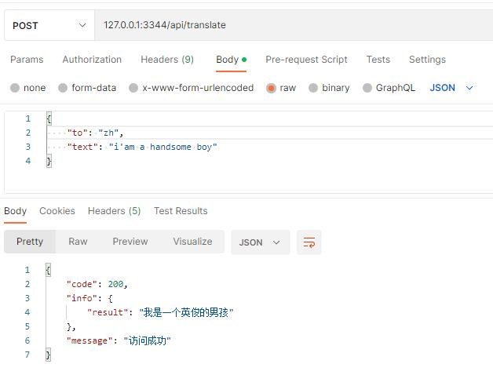

# 中英翻译服务

### 特性

- 后端：flask框架 pytorch环境
- 主要功能模块：提供中英翻译服务

### 安装

```
//第一次启动需要安装基础组件，可能需要消耗等待几分钟
//部署好服务之后，首次请求接口会很慢，因为第一次需要远程加载huggingface上的预检测模型
docker-compose up -d
```

### 接口

```POST http://ip:3344/api/translate```

字段设置

| 字段 | 是否必须 | 类型 | 描述 |
|-----|------|--------|--|
| to | 是 | string | 翻译目标语言，zh-中文，eng-英文 |
| text | 是 | string | 待翻译文本 |

请求返回：

```
{
    "code": 200,
    "info": {
        "result": "a great white shark swimming in the ocean"  //翻译结果
    },
    "message": "访问成功"
}
```

# 使用截图

- 


